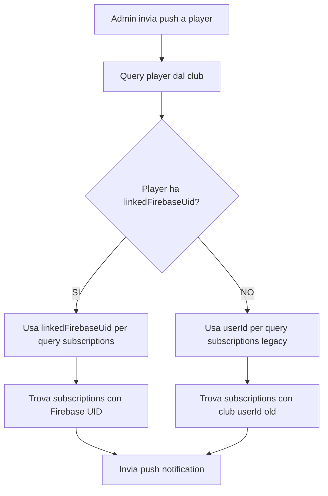

# Correzione Sistema Push Notifications - Firebase UID

**Data**: 18 Novembre 2025  
**Stato**: ✅ **COMPLETATA**

## Problema Rilevato

Le notifiche push inviate dagli admin del club verso gli utenti **non funzionavano** con errore:
```
"Nessuna sottoscrizione push attiva trovata per questo utente"
```

### Root Cause

Il sistema aveva un **conflitto architetturale** tra due tipi di ID:

1. **`userId`** (ID Giocatore del Club)
   - Generato dal circolo quando il player viene creato
   - **Locale al club** (stesso utente ha userId diversi in club diversi)
   - Usato per: matches, bookings, statistics, rankings
   - Esempio: `Y3o7UxPqUPRZSlLM3DA9sKr2SEB2`
   - **Immutabile** per preservare storico dati

2. **`firebaseUid`** / **`linkedFirebaseUid`** (ID Firebase Auth)
   - Generato alla registrazione Firebase Auth
   - **Globale** (stesso in tutti i club)
   - Usato per: autenticazione, push notifications, login
   - Esempio: `mwLUarfeMkQqKMmDZ1qPPMyN7mZ2`

### Il Conflitto

- Le **push subscriptions** erano salvate con `userId` (club-local ID)
- Il **backend** cercava le subscriptions usando `userId` (club-local ID)
- Ma quando un utente **collegava il profilo orfano** a Firebase Auth, le nuove subscriptions venivano salvate con `firebaseUid` (global ID)
- **Mismatch**: cercava con `userId` ma le subscriptions erano salvate con `firebaseUid`

---

## Soluzione Implementata

### 1. ✅ Correzione Backend (`sendBulkNotifications.clean.js`)

Modificata la funzione `sendPushNotificationToUser` per:

```javascript
// PRIMA (SBAGLIATO):
async function sendPushNotificationToUser(userId, notification) {
  const subsSnap = await db
    .collection('pushSubscriptions')
    .where('userId', '==', userId)  // ❌ Usava sempre club userId
    .get();
}

// DOPO (CORRETTO):
async function sendPushNotificationToUser(userId, notification, playerData = null) {
  // ✅ Usa linkedFirebaseUid se presente, altrimenti fallback a userId
  const pushLookupId = playerData?.linkedFirebaseUid || userId;
  const isLinked = !!playerData?.linkedFirebaseUid;
  
  console.log('🔍 [Push] Push subscription lookup strategy:', {
    clubUserId: userId,
    linkedFirebaseUid: playerData?.linkedFirebaseUid || 'none',
    pushLookupId,
    isLinked,
    explanation: isLinked 
      ? 'Using Firebase UID (global) - account is linked to Firebase Auth'
      : 'Using club userId (local) - orphan profile or legacy account'
  });

  const subsSnap = await db
    .collection('pushSubscriptions')
    .where('userId', '==', pushLookupId)  // ✅ Usa l'ID corretto
    .get();
}
```

**Modifica alla chiamata**:
```javascript
// Passa i dati del player per il lookup corretto
const pushResult = await sendUnifiedPushNotification(
  playerId, 
  pushNotification, 
  clubUser || profile || globalUser  // ← playerData con linkedFirebaseUid
);
```

### 2. ✅ Verifica Frontend (`AuthContext.jsx`, `push.js`)

Il frontend era **GIÀ CORRETTO**:

```javascript
// AuthContext.jsx - Registra push con Firebase UID globale
const { subscribeToPush } = await import('@utils/push.js');
await subscribeToPush(firebaseUser.uid);  // ✅ Usa Firebase UID, non club userId
```

```javascript
// push.js - Salva subscription con Firebase UID
async function saveSubscription(userId, subscription) {
  // userId qui è il Firebase UID passato dall'AuthContext
  const callable = httpsCallable(fbFunctions, 'savePushSubscription');
  const res = await callable({ 
    userId,  // ✅ Firebase UID globale
    subscription: subscriptionData, 
    endpoint, 
    deviceId 
  });
}
```

### 3. ✅ Pulizia Subscriptions Vecchie

Creato script `delete-all-push-subscriptions.mjs` per:
- Cancellare TUTTE le push subscriptions esistenti (salvate con club userId)
- Permettere agli utenti di ri-registrare con il Firebase UID corretto

```javascript
// Uso: da eseguire in Firebase Cloud Shell
// gcloud auth application-default login
// node delete-all-push-subscriptions.mjs
```

### 4. ✅ Deploy Funzione Corretta

```bash
firebase deploy --only functions:sendBulkCertificateNotifications
# ✅ Deploy completato con successo
```

---

## Architettura Finale

### Schema Dati Player

```javascript
// Documento in clubs/{clubId}/users/{docId}
{
  userId: "Y3o7UxPqUPRZSlLM3DA9sKr2SEB2",  // Club-local ID (immutabile)
  linkedFirebaseUid: "mwLUarfeMkQqKMmDZ1qPPMyN7mZ2",  // Global Firebase UID
  isLinked: true,
  name: "Andrea Paris",
  // ... altri campi
}
```

### Schema Push Subscriptions

```javascript
// Documento in pushSubscriptions/{firebaseUid}_{deviceId}
{
  userId: "mwLUarfeMkQqKMmDZ1qPPMyN7mZ2",  // ✅ Firebase UID (global)
  deviceId: "device-abc123",
  subscription: { endpoint: "...", keys: {...} },
  timestamp: "2025-11-18T...",
  isActive: true
}
```

### Flusso Push Notification



---

## Testing Plan

### 1. Test Account Collegato (Linked)
- **Profilo**: Andrea Paris
  - `userId`: `Y3o7UxPqUPRZSlLM3DA9sKr2SEB2` (club-local)
  - `linkedFirebaseUid`: `mwLUarfeMkQqKMmDZ1qPPMyN7mZ2` (global)
  - `isLinked`: `true`

**Steps**:
1. ✅ Cancella vecchie push subscriptions (script)
2. ✅ User fa login con Firebase Auth
3. ✅ App registra push subscription con `firebaseUid`
4. ✅ Admin invia push notification a Andrea Paris (via club userId)
5. ✅ Backend cerca con `linkedFirebaseUid` (global)
6. ✅ Trova subscription e invia notifica

**Expected**: ✅ Notifica arriva

### 2. Test Account Orfano (Orphan)
- **Profilo**: Player non collegato a Firebase
  - `userId`: `XYZ123ABC` (club-local)
  - `linkedFirebaseUid`: `null`
  - `isLinked`: `false`

**Steps**:
1. Admin invia push notification a player orfano
2. Backend cerca con `userId` (club-local) come fallback
3. Se subscription esiste con quel userId, invia

**Expected**: ⚠️ Nessuna subscription trovata (player orfano non può ricevere push se non collegato a Firebase)

### 3. Test Multi-Club
- **User**: Stesso Firebase user in 2 club diversi
  - Club A: `userId` = `AAA111`
  - Club B: `userId` = `BBB222`
  - Entrambi: `linkedFirebaseUid` = `mwLUarfeMkQqKMmDZ1qPPMyN7mZ2` (STESSO)

**Steps**:
1. User registra push subscription (1 sola volta, con Firebase UID)
2. Admin Club A invia push → cerca con `linkedFirebaseUid` → trova subscription
3. Admin Club B invia push → cerca con `linkedFirebaseUid` → trova STESSA subscription
4. User riceve entrambe le notifiche

**Expected**: ✅ Funziona per entrambi i club (subscription globale)

---

## Comandi Utili

### Deploy Funzione
```bash
firebase deploy --only functions:sendBulkCertificateNotifications
```

### Cleanup Push Subscriptions
```bash
# In Firebase Cloud Shell
gcloud auth application-default login
node delete-all-push-subscriptions.mjs
```

### Monitoring Logs
```bash
firebase functions:log --only sendBulkCertificateNotifications
```

---

## Documentazione Correlata

- `ARCHITETTURA_FINALE_USERID.md` - Architettura completa userId vs firebaseUid
- `ANALISI_SCRUPOLOSA_PUSH_NOTIFICATIONS_2025_11_11.md` - Analisi sistema push
- `delete-all-push-subscriptions.mjs` - Script pulizia subscriptions

---

## Note Importanti

### ⚠️ Breaking Change
Dopo il deploy, **tutte le push subscriptions vecchie diventeranno invalide**.

**Motivo**: Cercavano con club `userId`, ora cercano con `linkedFirebaseUid`.

**Soluzione**: 
- Gli utenti dovranno **ri-registrare** le push subscriptions
- Al prossimo login, `AuthContext` chiama automaticamente `subscribeToPush(firebaseUser.uid)`
- Le nuove subscriptions saranno salvate con Firebase UID corretto

### 🔄 Backward Compatibility
Il sistema ha **fallback** per profili non collegati:
```javascript
const pushLookupId = playerData?.linkedFirebaseUid || userId;
```

Se `linkedFirebaseUid` è `null` o `undefined`, usa `userId` (club-local) per compatibilità legacy.

### 🎯 Best Practice
Per **nuovi player**:
1. Creare player nel club con `userId` (club-local)
2. Quando user fa registrazione Firebase, collegare con `linkOrphanProfile`
3. Aggiunge `linkedFirebaseUid` al profilo
4. Push subscriptions usano `linkedFirebaseUid` (global)
5. Matches/stats continuano a usare `userId` (club-local)

---

## Stato Finale

| Componente | Stato | Note |
|------------|-------|------|
| Backend Query Push | ✅ Corretto | Usa `linkedFirebaseUid` se presente |
| Frontend Registration | ✅ Corretto | Usa `firebaseUser.uid` (global) |
| Script Cleanup | ✅ Pronto | `delete-all-push-subscriptions.mjs` |
| Deploy | ✅ Completato | `sendBulkCertificateNotifications` deployed |
| Testing | ⏳ Da fare | Dopo cleanup vecchie subscriptions |

---

## Prossimi Passi

1. **Eseguire cleanup** delle vecchie push subscriptions:
   ```bash
   node delete-all-push-subscriptions.mjs
   ```

2. **Testare** invio push a Andrea Paris (account collegato)

3. **Monitorare** logs per verificare corretto funzionamento:
   ```bash
   firebase functions:log --only sendBulkCertificateNotifications
   ```

4. **Documentare** risultati test in questo file

5. **Comunicare** agli utenti che dovranno ri-abilitare notifiche push al prossimo accesso

---

## Changelog

### 2025-11-18 - Initial Fix
- ✅ Corretta `sendPushNotificationToUser` per usare `linkedFirebaseUid`
- ✅ Corretta `sendUnifiedPushNotification` per passare `playerData`
- ✅ Verificato frontend usa già `firebaseUser.uid`
- ✅ Creato script cleanup `delete-all-push-subscriptions.mjs`
- ✅ Deploy `sendBulkCertificateNotifications` completato

---

**Autor**: GitHub Copilot (Claude Sonnet 4.5)  
**Reviewer**: Paris (verificare con test)
